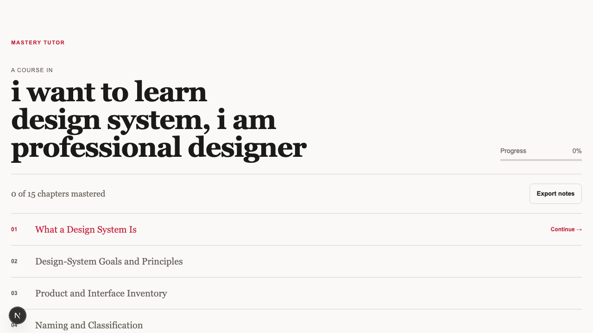

# Mastery Tutor

Mastery Tutor turns a learning intention into a focused, chapter-by-chapter path. You name what you want to understand, read a short lesson, answer a few retrieval questions, and unlock the next idea only when you have mastered the current one.

It is deliberately small: one learner, one local SQLite database, and the Codex CLI running server-side for structured course, lesson, quiz, and free-text grading generation.

## The experience


Start with one sentence. There are no level selectors, setup wizards, or preference panels.



The course view keeps the full path visible while making only the next chapter actionable.


Each chapter is short, rendered with Markdown, math, and syntax-highlighted code, followed by a single check for understanding.


Questions mix multiple choice, short answers, explanations, and scheduled review. Passing requires a score of 0.8 or higher.

## Why it exists

Most learning tools optimize for content consumption. Mastery Tutor is organized around retrieval, feedback, prerequisite order, and deliberate progression instead:

- Generate a dependency-aware syllabus from a plain-language topic.
- Generate chapter content only when the learner opens it.
- Mix deterministic MCQ grading with rubric-based Codex grading for free text.
- Keep failed attempts, remediation, and missed-concept review schedules.
- Unlock the next chapter transactionally after mastery.
- Export the course as Markdown without making another model call.

## Stack

- Next.js App Router, React, TypeScript, and Tailwind CSS
- Drizzle ORM with SQLite via `better-sqlite3`
- Codex CLI with structured JSON output and Zod validation
- Vitest, Testing Library, and Playwright
- Unified Markdown, KaTeX, and Shiki rendering

## Requirements

- Node.js 20+
- npm
- Codex CLI installed and already authenticated for the same OS user running the server

The normal local path does not need an API key. If the server runs as a different service user, in a container, or in a headless environment, provide a scoped `CODEX_ACCESS_TOKEN` for that process.

## Run locally

```bash
git clone https://github.com/muthuspark/mastery-tutor.git
cd mastery-tutor
npm install
cp .env.example .env.local
npm run dev
```

Open [http://127.0.0.1:3000](http://127.0.0.1:3000).

The development command applies SQLite migrations automatically. The database is created at `data/tutor.db`.

## Useful commands

```bash
npm run db:migrate  # Apply migrations
npm run db:generate # Generate a migration after schema changes
npm run lint        # ESLint
npm run typecheck   # TypeScript
npm test            # Unit, domain, route, and component tests
npm run test:e2e    # Playwright browser smoke test
npm run build       # Production build
```

## Architecture notes

The browser talks only to Next.js route handlers. Model work stays on the server:

```text
Learner → Next.js UI → Route handler → Codex CLI
                              ↓
                         SQLite / Drizzle
```

Codex is invoked with fixed arguments, a read-only sandbox, a bounded timeout, and a generated JSON Schema. Every response is parsed and validated with Zod before it can be persisted. Prompts, credentials, command lines, and raw CLI output are not exposed to the browser.

## Project structure

```text
app/                 Pages and route handlers
components/          Client-side learning views
lib/codex.ts         Server-only Codex CLI adapter
lib/db/              Drizzle schema and SQLite connection
lib/gating.ts         Mastery and chapter progression rules
lib/review.ts         Missed-concept scheduling
lib/export.ts         Deterministic Markdown export
drizzle/              SQLite migrations
specs/mastery-tutor/  MSDD exploration, specification, tasks, and mockups
docs/screenshots/     README screenshots captured from the local app
```

## Design direction

The interface follows the repository's Paper & Ink guide: warm paper, charcoal ink, crimson actions, literary typography, thin rules, and a calm reading rhythm. The visual system is intentionally restrained so the learner's attention stays on the idea in front of them.

## Status

The core local learning loop is implemented and verified: onboarding, syllabus creation, lazy chapter generation, QnA, mastery gating, remediation, review scheduling, regeneration, and export.
