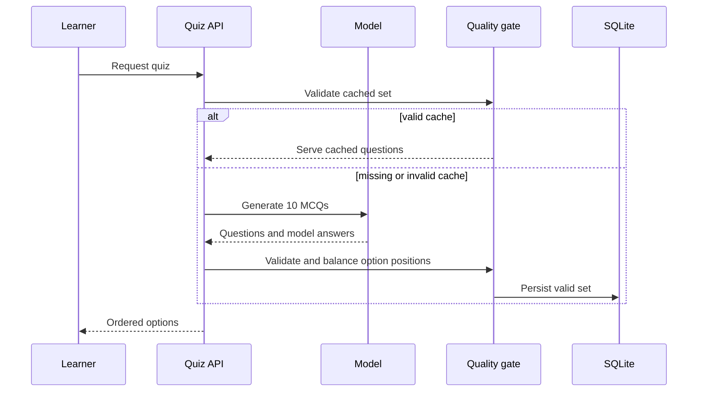

# assessment-question-quality

## Summary

Build reliable, fair multiple-choice assessments.

- Each ten-question quiz has four answer choices per question.
- Correct positions are balanced across A-D.
- Distractors are credible enough that learners cannot pass by choosing A.
- Scope includes generation, validation, persistence, regeneration, tests, and live Chrome verification on a new Distributed Systems course.

## Problem

The current assessment behavior is invalid:

- The local SQLite database has 10 Operating Systems MCQs, and every `modelAnswer` equals `options[0]`.
- Distractors are visibly unrelated to the question.
- Learners can infer the pattern, artificially pass the 0.8 gate, and lose trust.
- The prompt, Zod schema, generator, and persistence path do not enforce answer position or distractor quality.

## Goals and Non-Goals

### Goals

- Deliver only valid four-option MCQs.
- Require exactly one answer-equivalent option.
- Produce a 10-question A-D distribution of two or three correct answers per position.
- Use related, distinct distractors and replace unusable cached question sets.
- Preserve deterministic text-based grading.

### Non-goals

- Psychometric calibration or adaptive difficulty.
- Changes to the mastery threshold or historical attempts.
- Automatically guaranteeing semantic quality that cannot be structurally evaluated.

## Users and Scenarios

### Actors

- Learner.
- Developer/tester.

### Scenarios

1. A learner opens a fresh chapter quiz and receives ten four-choice questions with two or three correct answers in each A-D position.
2. A learner retries after failure and receives a newly generated valid question set without a predictable answer pattern.
3. A developer tests malformed or skewed model output and observes rejection or retry rather than persistence.
4. A tester uses live Chrome to create a Distributed Systems course, opens chapter 1's quiz, and confirms the displayed answer distribution and credible options.

## Requirements

- REQ-001 (P0): The generator prompt must require exactly four concise, distinct, topic-relevant options: one correct answer and three plausible misconception-based distractors.
- REQ-002 (P0): The quality gate must normalize values and require the model answer to occur exactly once among the four options.
- REQ-003 (P0): The quality gate must reorder valid options into a 10-item answer-position plan where each A-D position occurs two or three times.
- REQ-004 (P0): Invalid generated output must not be stored or served. The system retries once, then returns the existing retryable generation error.
- REQ-005 (P1): Quiz retrieval must replace an invalid, unattempted cached set before returning it.
- REQ-006 (P0): Grading must continue to accept selected option text and compare it with the aligned `modelAnswer`.

## User/System Flows

1. The learner requests a chapter quiz.
2. The API validates cached MCQs. It serves a valid set or regenerates an invalid or missing set.
3. The generator requests structured output with strengthened prompt rules.
4. The quality module normalizes and validates the output, maps correct answers to a planned A-D position, and produces persisted rows.
5. The API returns the ordered options; the UI displays them unchanged.
6. The learner selects option text; the grader compares its normalized value with `modelAnswer`.
7. If model output fails validation twice, no rows are inserted and the API returns the existing retryable generation error.

## Technical Design

### Solution Description

Add a pure assessment-quality module used by both generation and quiz retrieval. It validates model output, assigns each correct answer to a random balanced A-D position plan, and persists the resulting option order once per question set.

### Current State

The prompt and schema permit all-A answers and invalid cached rows. The UI displays the stored option order.

### Proposed Design

Strengthen `QUIZ_PROMPT`; require four distinct normalized choices and one normalized model-answer match; re-order valid options to a balanced plan; and regenerate invalid unattempted cache.

### Architecture / Components

`lib/prompts.ts`, `lib/schemas.ts`, new `lib/assessment-quality.ts`, `lib/quiz.ts`, the quiz API route, and unit, route, and browser tests.

### Data Model / API Changes

None. `options` remains ordered JSON text and `modelAnswer` remains text.

### Technical Decisions

Balance and store option order once per generated set. Do not shuffle per request because a learner retry must see a stable question set.

### Trade-offs

Structural checks cannot prove semantic plausibility. A retry can require one extra model call.

### Failure Handling

Reject invalid output, retry once, persist only complete valid sets, and return the standard retryable error after the second failure.

### Testing Strategy

Use an injected deterministic random source for permutation and distribution tests; mocked agents for retry/no-persistence tests; and live Chrome with a fresh Distributed Systems course.

## Decisions and Constraints

### Confirmed Decisions

- Use four options and two or three correct answers in each A-D position per 10-question set.
- Randomize and store option order once per generated set.
- Regenerate invalid cached sets and include live Chrome testing with a new Distributed Systems course.

### Assumptions

- Model output retains `modelAnswer` text after option ordering.
- Existing error mapping supports retryable generation errors.

### Constraints

- No schema migration, completed-attempt changes, secret exposure, or Next.js route behavior changes.

### Open Questions

- None block implementation. Prompt rules and visible Chrome review guide distractor quality; it is not automatically scored.

## Edge Cases and Failure Handling

- **Missing or duplicate model answer:** Reject before persistence, retry once, then return a retryable generation failure.
- **Invalid options:** If there are not four options, options normalize to duplicates, or an option is blank, reject and retry.
- **Unbalanced positions:** Reorder valid options to the generated position plan; reject only if this is impossible.
- **Invalid legacy cache:** Do not serve it; atomically delete and replace its unattempted questions.
- **Attempted questions:** Retain history and generate a separate valid set; never delete referenced rows.

## Acceptance Criteria

- AC-001: Unit tests prove a normalized model answer occurs in exactly one of four distinct options and rejects invalid cases.
- AC-002: Generated 10-question sets have each correct position A-D exactly two or three times, verified from persisted options and answers.
- AC-003: Mocked invalid agent output is retried once and creates zero question rows when both attempts fail.
- AC-004: Invalid unattempted cached rows are not served and are replaced.
- AC-005: Selected correct option text still receives score `1` after reordering.
- AC-006: A live Chrome test creates a new Distributed Systems course, reaches its first quiz, verifies ten four-option questions and a 2-3 A-D correct-answer distribution from the response/database, and visually confirms no systematic obvious-answer pattern.

## Explanation and Output Artifacts

- Audience: Maintainers and reviewers.
- Writing profile: 80% ASD-STE100.
- Primary artifact: This specification and its technical flow diagram.
- Supporting artifacts: Automated-test evidence and a concise live-Chrome report for the new Distributed Systems course, recorded in implementation notes.
- Accessibility: Surround Mermaid with equivalent prose. Test evidence uses clear labels and does not depend on color.

## Implementation Plan

1. Add a pure assessment-quality module with normalization, integrity checks, balanced position-plan creation, and option reordering; cover its boundaries with unit tests.
2. Update the quiz prompt and Zod contracts to require four distinct relevant options and one answer match.
3. Integrate quality validation, one retry, and atomic persistence into `generateQuiz`; preserve grading semantics and add mocked-agent tests.
4. Update quiz retrieval to identify and replace invalid unattempted cached sets without touching attempted history; add route tests.
5. Run lint, typecheck, unit, and route tests; record results.
6. Run the app and use live Chrome to create a new Distributed Systems course, open the first assessment, inspect ten questions and A-D distribution, and record visible distractor-quality evidence.

## Verification and Implementation Notes

- **Evidence:** All implementation and verification work is complete. On 2026-10-09, `npm run lint`, `npm run typecheck`, and `npm test` passed (11 files, 24 tests). Chrome DevTools created a Distributed Systems course and verified its 10-question assessment had four options per question with A=3, B=3, C=2, and D=2 correct-answer positions. Route tests verify invalid unattempted cache replacement preserves attempted questions.
