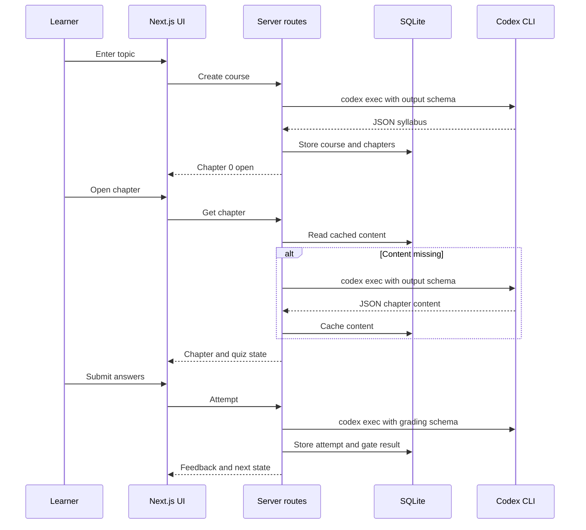
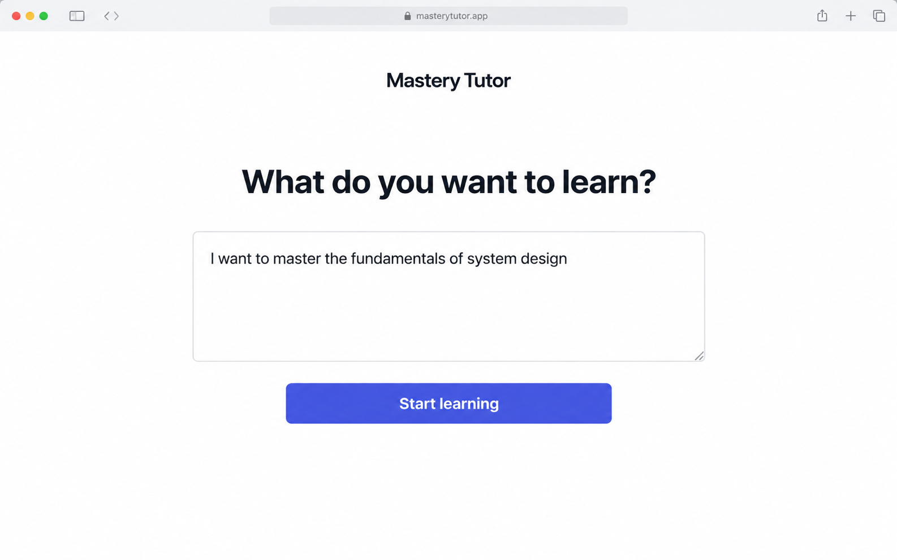
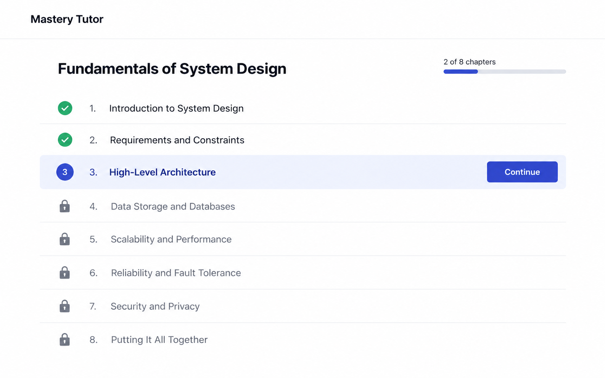
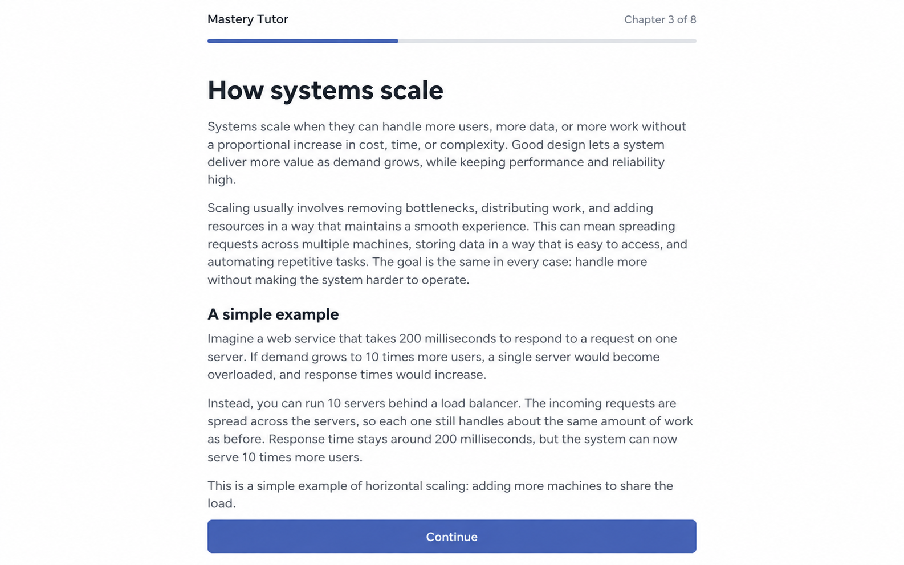
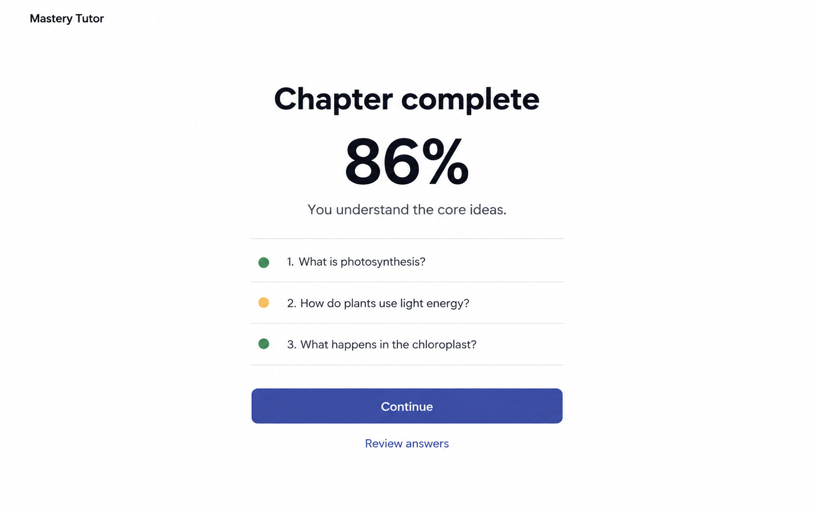

# Mastery Tutor

## Summary

<!-- Format: State the outcome, scope, and measurable reason for doing this. -->

Build Mastery Tutor, a local single-user learning app that generates a first-principles course for a topic and guides the learner through short chapters with mastery-gated QnA. The outcome is a usable end-to-end course flow with cached LLM content, progress tracking, remediation, review questions, and markdown export. Initial release targets one local user and no authentication.

## Problem

<!-- Format: Describe the current behavior, observed failure/opportunity, affected users, and evidence. -->

A learner needs structured instruction for an unfamiliar topic, but a generic generated explanation does not prove understanding or adapt after mistakes. The current repository has no implementation. The TRD defines the desired behavior: one core idea per short chapter, pretesting, retrieval practice, feedback, spaced review, and an 80% mastery gate.

## Goals and Non-Goals

<!-- Format: Use two labeled lists: Goals and Non-goals. Keep each item testable or explicitly bounded. -->

Goals:
- Generate a dependency-ordered syllabus of 6–15 chapters from a single natural-language topic.
- Let the learner review and edit the syllabus before starting.
- Generate and cache chapters lazily, including a prediction question, <=600-word markdown content, and summary.
- Generate 3–5 validated questions, grade answers, show explanations, track attempts, and unlock the next chapter at >=80%.
- Add up to two due review questions, remediation after failure, depth feedback, prefetching, regeneration, and markdown export.
- Keep secrets server-side and validate every LLM response with Zod.

Non-goals:
- Authentication, multiple users, collaboration, cloud synchronization, or production multi-tenancy.
- Mobile-native clients, payments, analytics, or a general authoring platform.
- Silent regeneration or automatic replacement of cached generated content.
- Treating the named future model identifiers as guaranteed; model configuration must be verified and replaceable.

## Users and Scenarios

<!-- Format: List actors and numbered scenarios. Include the expected result for each scenario. -->

Actors:
- Local learner: enters a topic, studies chapters, answers QnA, and reviews feedback.
- Server application: persists course state, enforces gates, calls the LLM, and grades answers.

1. Create course: learner enters a non-empty topic; the system chooses sensible defaults, generates a syllabus, stores it, and opens chapter 0.
2. Edit syllabus: learner changes allowed chapter metadata before starting; the system persists the changes and retains dependency order validation.
3. Study chapter: learner opens an available chapter; the system lazily generates content once, shows the pretest and markdown, and prepares its quiz.
4. Pass chapter: learner submits answers; the system grades all answers, shows feedback/model answers, records the attempt, marks the chapter passed, and opens the next chapter.
5. Fail and retry: learner scores below 80%; the system shows remediation and feedback, records misses, keeps the chapter open, and offers a fresh quiz.
6. Review: a later quiz includes no more than two due review questions from missed concepts.
7. Adjust difficulty: learner selects Too easy or Too hard; the system stores a depth hint for the next chapter generation.
8. Export: learner exports the current course and generated content as readable markdown.

## Requirements

<!-- Format: Use stable IDs such as REQ-001. For each requirement state the behavior, inputs/outputs, and priority. -->

- REQ-001 (P0): Accept POST /api/courses with topic only, reject invalid input, apply default instructional settings server-side, generate a Zod-validated 6–15 chapter syllabus, persist it, and open only chapter 0.
- REQ-002 (P0): Provide a course view with title, passed/total progress, chapter stepper, lock state, and editable syllabus metadata before study starts.
- REQ-003 (P0): Enforce availability server-side; a locked chapter cannot be read, generated, quizzed, or attempted.
- REQ-004 (P0): Lazily generate each available chapter with prior summaries, missed concepts, and depth hint; persist pretest, <=600-word markdown content, and summary; never regenerate silently.
- REQ-005 (P0): Render chapter markdown with safe Markdown, KaTeX, and syntax highlighting support, then provide a Take QnA action.
- REQ-006 (P0): Generate 3–5 objective-based questions from MCQ, short, and explain types; include model answers, rubrics, and concept tags; persist generated questions.
- REQ-007 (P0): Return up to two due review items with a chapter quiz and mark them as review questions.
- REQ-008 (P0): Grade MCQs locally and free-text answers through a server-side `codex exec` call with schema-validated output; every answer must return a score and why-right/wrong feedback.
- REQ-009 (P0): Persist attempts and answers. A score >= 0.8 marks the chapter passed and opens the next chapter; a lower score keeps it open and returns remediation plus fresh-retry behavior.
- REQ-010 (P1): Upsert missed concepts into a review queue scheduled one to two chapters later.
- REQ-011 (P1): Persist Too easy/Too hard depth hints for the next chapter.
- REQ-012 (P1): Support explicit chapter regeneration and markdown export; regeneration must be user-triggered and must not erase attempt history without confirmation.
- REQ-013 (P0): Keep Codex credentials and all model calls on the server; invoke only an allowlisted `codex exec` command with no shell interpolation; return stable, non-secret JSON errors for validation, unavailable chapters, CLI failures, timeouts, and database failures.
- REQ-014 (P1): Provide loading, empty, retry, and failure UI states, and keep course/quiz state synchronized with TanStack Query.
- REQ-015 (P1): Persist timestamps and stable IDs in SQLite through Drizzle migrations; use a configurable local database path.

## User/System Flows

<!-- Format: Use numbered steps. Name the actor, system action, state change, and failure branch at each relevant step. -->

1. Create course
   1. Learner submits a topic.
   2. Server validates input, applies default instructional settings, and calls the syllabus model with zero-knowledge/dependency-order prompts.
   3. Server validates output, inserts course and chapters, sets chapter 0 to open, and returns the course.
   4. On validation/Codex/database failure, return a stable error and create no partial course.
2. Study and prefetch
   1. Learner selects an open chapter.
   2. Server checks course ownership assumptions and chapter status.
   3. If content is missing, server gathers prior summaries/missed concepts, generates Chapter output, validates it, and caches it.
   4. Client renders pretest, content, summary, and controls. Quiz generation may prefetch in the background; failure remains retryable.
3. Quiz and gate
   1. Client requests quiz; server returns cached questions plus up to two due review questions, or generates and validates a new set.
   2. Learner submits all responses.
   3. Server validates question IDs and response shape, grades locally or through Codex CLI, stores attempt/answers, and computes the weighted score.
   4. If score >= 0.8, mark passed and open the next locked chapter if prerequisites are satisfied. Otherwise keep open, upsert misses, and return feedback/remediation with a fresh retry option.
4. Export
   1. Learner requests export.
   2. Server reads persisted course/chapter data and returns/downloads markdown.
   3. Missing generated content is labeled clearly or excluded according to the export contract; export never triggers an LLM call.

## Technical Design

<!-- Format: Describe components, interfaces, data, dependencies, compatibility, security, and operational concerns. -->

Solution Description
Use a Next.js App Router application with server route handlers as the trust boundary. React pages use TanStack Query to call route handlers. Domain modules own gating, review scheduling, and export behavior. Drizzle persists SQLite entities. A server-only Codex adapter invokes `codex exec` as a subprocess, passes prompts through stdin, requests JSON output with an output schema, parses the final message, and validates it again with Zod.

Current State
The repository now contains the initial Next.js App Router scaffold. Feature behavior and persistence are not implemented yet.

### Research Basis and Design Implications

The product uses established learning-science findings as design guidance. These findings support the instructional mechanisms; they do not prove that this specific app will improve learning for every user. The 80% gate is a product threshold for progression, not a universal definition of mastery.

| Research finding | Product implication | Implementation rule |
|---|---|---|
| **Mastery learning.** Bloom’s 1984 discussion of the “2 sigma problem” describes stronger outcomes when instruction includes individualized pacing, formative checks, and corrective support. See [Bloom (1984)](https://doi.org/10.3102/0013189X013006004). | Do not make chapter progression purely time-based. Let the learner retry after a weak result and provide targeted remediation. | Keep the current chapter open below 0.8; unlock the next chapter only at `score >= 0.8`; preserve attempt history. Treat the threshold as an adjustable product policy. |
| **Retrieval practice.** Roediger and Karpicke found that testing can improve delayed retention more than equivalent restudy, especially after a delay. See [Roediger & Karpicke (2006)](https://doi.org/10.1111/j.1467-9280.2006.01693.x). | The QnA is part of learning, not only assessment. Prefer recall, explanation, and application over recognition-only quizzes. | Generate short-answer and explain-why questions in addition to MCQs; grade them with rubrics and show corrective feedback. |
| **Spacing.** Cepeda and colleagues’ review and quantitative synthesis found that distributed practice generally improves later retention, with useful spacing depending on the desired retention interval. See [Cepeda et al. (2006)](https://pubmed.ncbi.nlm.nih.gov/16719566/). | Revisit missed concepts after the learner has moved forward instead of repeating all questions immediately. | Add missed concepts to `reviewItems`, schedule them one to two chapters later, and include no more than two due review questions in a later quiz. This is a simple v1 schedule, not a personalized forgetting-curve model. |
| **Cognitive load and worked examples.** Sweller’s work argues that problem-solving demands can consume capacity needed for schema acquisition, especially for novices. See [Sweller (1988)](https://doi.org/10.1207/s15516709cog1202_4). | Introduce one core idea at a time. Start with a concrete worked example before asking the learner to apply the idea. | Limit generated chapter content to about 600 words, require a worked example or concrete problem at the start, define terms on first use, and connect to prerequisites. |
| **Pretesting.** Richland, Kornell, and Kao reported a pretesting effect in which attempting questions before study can improve later learning, including for items not successfully retrieved initially. See [Richland et al. (2009)](https://pubmed.ncbi.nlm.nih.gov/19751074/). | Ask the learner to predict before revealing the explanation. A wrong prediction is useful if the later explanation resolves it. | Put one prediction question before chapter content; do not penalize it as the mastery score; show the explanation during or after the chapter. |
| **Elaborative feedback.** Hattie and Timperley’s review describes feedback as potentially powerful but dependent on its type, timing, and usefulness to the learner. See [Hattie & Timperley (2007)](https://doi.org/10.3102/003465430298487). | A right/wrong label is insufficient. Feedback must close the gap between the learner’s response and the target understanding. | Every graded answer returns why it is right or wrong, the model answer, and a missed concept when relevant. Feedback appears immediately on the results screen and informs remediation/review. |

Research guardrails:

- Do not claim that generated content, LLM grading, or an 80% threshold has been clinically or educationally validated by this project.
- Prefer equivalent phrasing in free-text grading, but treat the rubric and model answer as the grading contract.
- Monitor false positives and false negatives in grading during testing; allow explicit retry when grading is unavailable or ambiguous.
- Evaluate learning outcomes separately from product engagement. Completion rate and score are operational metrics, not direct evidence of durable learning or transfer.

### Minimal UI Direction

The interface must get the learner from intent to learning with one decision: what they want to learn. Do not ask for level, difficulty, format, or goals during onboarding. The server chooses foundational defaults and learns from performance later.

- Onboarding has one text field and one primary action: `Start learning`.
- The first screen has no preview panel, sidebar, search, marketing copy, or secondary action.
- The dashboard shows only the course title, progress, chapter list, and one `Continue` action for the current chapter.
- The chapter page shows the reading content and one `Continue` action. Pretesting and QnA remain part of the learning flow, but appear at the relevant moment instead of competing with the reading task.
- Results show the score, concise feedback, and one `Continue` action. Detailed answer review is secondary and progressive.
- Difficulty feedback remains available after learning activity, but is not presented as an onboarding choice or persistent dashboard control.
- Use one type family, one accent color, simple dividers, generous whitespace, and no nested cards.

Removed complexity: the onboarding level selector, generated-course preview panel, dashboard sidebar, search, extra dashboard cards, persistent difficulty controls, circular score gauge, motivational quote, and multiple competing navigation actions. These elements can be reconsidered after the core learning loop is validated.

Proposed Design
Create routes for courses, chapters, quizzes, attempts, syllabus edits, regeneration, difficulty hints, and export. Keep generated chapter/quiz data cached with explicit regeneration. Centralize input/output schemas and stable error mapping. Use transactions for course creation, attempt persistence, and gate transitions. The server must never pass user input into a shell command string; use a direct child-process API with fixed executable and argument arrays.

Architecture / Components
- `app/`: pages for course list, course progress, chapter, quiz, and results; route handlers under `app/api`.
- `components/`: progress bar, chapter, quiz, results, loading/error states.
- `lib/db`: Drizzle schema, SQLite connection, migrations.
- `lib/codex.ts`, `lib/prompts.ts`, `lib/schemas.ts`: Codex CLI invocation, prompts, and Zod contracts.
- `lib/gating.ts`, `lib/review.ts`, `lib/export.ts`: pure domain rules and serialization.
- Codex CLI: server-only, installed and version-checked on the host. For the local app, use the existing Codex login of the same OS user that runs the Next.js server. `CODEX_ACCESS_TOKEN` is optional and is only needed when the server runs as a different service user, in a container, or in another headless environment. Keep all credentials out of request payloads, logs, browser code, and SQLite.

Data Model / API Changes
Use the TRD entities: courses, chapters, questions, attempts, answers, and reviewItems. Add optional fields needed for explicit lifecycle behavior such as `startedAt`, `generatedAt`, `depthHint`, `isReview`, and `sourceAttemptId` only if implementation confirms they are needed. Enforce unique chapter index per course, question identity per chapter, and foreign keys. Core APIs: POST /api/courses; GET/PATCH /api/courses/:id; GET /api/chapters/:id; GET /api/chapters/:id/quiz; POST /api/chapters/:id/attempts; POST /api/chapters/:id/regenerate; POST /api/chapters/:id/feedback; GET /api/courses/:id/export.

Sequence

Technical Decisions
- Server-side authorization is status/ID validation because the app is explicitly local single-user; no auth layer in v1.
- Structured Codex output is mandatory; invoke `codex exec` with a checked-in or generated JSON schema and validate the parsed result with Zod. Invalid output is an error, not best-effort persistence.
- Use a direct subprocess API with fixed arguments, stdin for prompts, a bounded environment, and a maximum execution time. Do not use `sh -c`, shell interpolation, or a user-controlled executable/model path.
- MCQ scoring is deterministic and free-text grading is rubric-based with equivalent phrasing accepted.
- Scores are normalized to [0,1]; pass threshold is 0.8 inclusive.
- Cached content is immutable during normal reads; regeneration is explicit and visible.

Trade-offs
- SQLite and local single-user operation reduce setup and support offline-ish persistence, but do not provide multi-user deployment.
- Lazy generation lowers initial latency and cost, but chapter opening can have a first-load delay.
- Codex grading supports explanation and free recall, but is less deterministic and adds subprocess latency; rubric, schema, bounded inputs, timeouts, and tests reduce risk.
- Calling the CLI avoids a direct Platform API integration in application code, but it does not remove authentication or model-service dependency. It shifts credential, process, and host-management responsibility to the server.
- Keeping attempt history increases storage but supports progress auditing and review scheduling.

Failure Handling
Map invalid input to 400, unavailable/locked resources to 403 or 404 as appropriate, Codex missing/not authenticated to a setup error, CLI non-zero exit or malformed JSON to retryable 502, timeout to 504, and database failures to 500 with a request-safe message. Use idempotency/transaction boundaries to avoid duplicate course or attempt records. Do not expose prompts, credentials, stack traces, command lines, or raw CLI output. Capture bounded server logs with a correlation ID only.

Testing Strategy
Unit-test Zod schemas, score calculation, chapter gating, prerequisite checks, review due-date selection, remediation selection, and export formatting. Route-test validation, status transitions, transaction rollback, cached versus generated paths, direct child-process argument construction, timeout/exit-code mapping, and stable errors with a mocked Codex adapter. Component-test locked/open/passed states, quiz feedback, retry, loading, and failure UI. Add one browser-level happy path from topic creation through pass and one fail/retry path.

Compatibility / Operations
Provide migration commands, a local database location, and Codex CLI installation/version checks. Do not require a credential in `.env.local` for the normal local path: the server reuses the existing Codex login for the same OS user. Verify the installed CLI supports non-interactive `codex exec`, JSON output, output schemas, model selection, and reasoning configuration before implementation. Keep the model configurable, but allowlist accepted model IDs. If the server runs under a different user, in a container, or in headless automation, support an explicit, scoped, expiring `CODEX_ACCESS_TOKEN` as the alternate authentication path.

## Decisions and Constraints

<!-- Format: Separate Confirmed decisions, Assumptions, Constraints, and Open questions. Do not hide unresolved choices. -->

Confirmed decisions:
- Use the TRD as the product scope and use Next.js App Router, TypeScript, Tailwind, TanStack Query, Drizzle/better-sqlite3, the Codex CLI, and Zod. The Vercel AI SDK is not required for the Codex subprocess path.
- Chapter 0 is initially open; score >= 0.8 is the inclusive pass threshold.
- Include prediction, short content, retrieval questions, explanations, remediation, spaced review, and difficulty controls.
- Store generated content and attempts; never silently regenerate.

Assumptions:
- One local user can access local course IDs; no authentication is needed for v1.
- Syllabus edits happen before starting and do not rewrite already generated chapter content.
- A review item is eligible when its due chapter index is reached and no more than two are selected per quiz.
- The app can show a retryable error when the LLM is unavailable.

Constraints:
- Codex credentials and all model calls stay server-side.
- The server invokes only an allowlisted `codex exec` executable with fixed argument arrays and bounded execution time.
- All LLM outputs pass Zod validation.
- Chapter content is <=600 words and syllabus size is 6–15 chapters.
- Avoid forward references in generated syllabus/chapter prompts.

Open questions:
- Confirm the installed Codex CLI version, supported `codex exec` flags, actual model IDs, reasoning configuration, and authentication method.
- Confirm that the local server process runs as the same OS user as the existing Codex login. Use `CODEX_ACCESS_TOKEN` only for a different user, container, or headless deployment; do not support browser-session scraping.
- Confirm exact export treatment for chapters not generated yet.
- Confirm whether regeneration creates a version record or replaces the current chapter content while preserving attempts; default is explicit replacement with history preserved in v1.

## Edge Cases and Failure Handling

<!-- Format: Use a case/action table or bullets with trigger, expected behavior, recovery, and user-visible error. -->

Cases:
| Trigger | Expected behavior | Recovery / user-visible result |
|---|---|---|
| Blank or oversized topic | Reject before LLM call | 400 field error; keep form values |
| Syllabus has invalid chapter count/dependencies | Reject output and persist no course | Retry generation; show safe error |
| Learner requests locked chapter | Do not generate or reveal content | 403/locked state |
| Duplicate attempt submission | Detect request/attempt identity or transaction conflict | Return existing result or safe conflict; do not double-unlock |
| Codex timeout, non-zero exit, or malformed output | Log a bounded server-safe diagnostic and return a retryable error | Retry action; cached content remains unchanged |
| Free-text grading unavailable | Do not mark answer passed by default | Retry grading/attempt; show attempt not finalized |
| Score exactly 0.8 | Pass | Mark chapter passed and unlock next chapter |
| Final chapter passed | Mark course complete; no next chapter update | Show completion/export controls |
| No due review items | Generate/use only current chapter questions | Quiz remains 3–5 questions |
| Regenerate chapter | Require explicit action and preserve attempts | Replace only generated content/question cache per documented policy |
| Database failure during attempt | Roll back attempt, answers, and gate transition | 500 retryable error; no partial progress |
| Export with missing content | Never invoke LLM | Include available material and clear placeholders/metadata |
| Unsafe markdown or model text | Sanitize rendered output and links | Render safe content only |

## Acceptance Criteria

<!-- Format: Use stable IDs such as AC-001. Make each criterion observable and state how it will be verified. -->

- AC-001: A learner can create a course from a valid topic and sees 6–15 ordered chapters with only chapter 0 open. Verify with route and browser tests.
- AC-002: Invalid syllabus output cannot create a partial course. Verify with mocked malformed LLM output and database assertions.
- AC-003: The course view shows passed/total progress and locked chapter indicators. Verify with component tests.
- AC-004: Opening a chapter generates content once, caches it, renders the pretest and <=600-word markdown, and does not call the LLM on subsequent reads. Verify with mocked call counts.
- AC-005: A quiz contains 3–5 objective-based questions and at most two eligible review questions. Verify with domain and route tests.
- AC-006: MCQs are graded deterministically and free-text answers receive score, feedback explaining why, and missed concept. Verify with mocked grader output.
- AC-007: A score of 0.8 or higher passes the chapter and unlocks the next eligible chapter; a lower score does not. Verify boundary tests.
- AC-008: Failed attempts show remediation and allow a fresh question set while preserving prior attempt history. Verify with integration tests.
- AC-009: Missed concepts become due review items one to two chapters later and appear at most twice per quiz. Verify scheduling tests.
- AC-010: API responses never expose the Codex credential, raw CLI output, command line, or server stack trace. Verify error contract tests.
- AC-011: Too easy/Too hard is persisted and affects the next generated chapter prompt. Verify with prompt-builder tests.
- AC-012: Explicit regeneration and markdown export work without silent generation or loss of attempt history. Verify route tests and exported content assertions.
- AC-013: The app provides loading, empty, retry, locked, failed, passed, and course-complete states. Verify component/browser tests.

## Explanation and Output Artifacts

<!-- Format: Use labeled fields: Audience, Writing profile, Primary artifact, Supporting artifacts, and Accessibility. Prefer an 80% ASD-STE100 controlled-language style for explanatory prose unless strict ASD-STE100 or plain language is required. Choose the clearest medium: prose, diagram, interactive HTML, or narrated explainer video. State the topic, purpose, interaction or narration needs, delivery location, and acceptance evidence for each requested artifact. -->

Audience: the developer implementing the local app and the product owner reviewing scope.
Writing profile: 80% ASD-STE100 controlled-language style: short sentences, clear terms, active voice, and no unexplained acronyms.
Primary artifact: `specs/mastery-tutor/spec.md`, a concise implementation specification. It explains the learner flow, server boundary, data model, gate rule, and failure paths.
Supporting artifacts: `specs/mastery-tutor/task.md` with ordered implementation tasks; Mermaid sequence diagram in the Technical Design section; `trd.md` remains the source requirement document.
Accessibility: use readable Markdown headings, labeled tables, text equivalents for diagrams, and explicit error/state descriptions. Acceptance evidence is the completed task list plus the verification commands and tests recorded in the spec notes.

### UI Mockup Images

These images are illustrative references for layout, hierarchy, state, and visual tone. They are not pixel-perfect implementation requirements. Use the functional requirements and acceptance criteria as the source of truth.

*Course onboarding: the learner enters one natural-language goal and starts. Example input: “I want to master the fundamentals of system design”. No level or format choices are shown.*

*Course dashboard: course title, progress, a simple chapter list, and one Continue action for the current chapter.*

*Chapter view: progress, one focused reading column, and one Continue action. Pretest and QnA appear at the relevant step rather than crowding the reading screen.*

*Quiz results: score, concise feedback, one Continue action, and a secondary Review answers link.*

## Implementation Plan

<!-- Format: Use ordered, independently verifiable tasks. Include dependencies and the files or boundaries affected. -->

1. Scaffold the Next.js App Router TypeScript project, Tailwind, TanStack Query, environment example, lint/test setup, and server-only configuration.
2. Add Drizzle SQLite connection, migrations, schema, indexes, foreign keys, and seed/migration commands for courses, chapters, questions, attempts, answers, and review items.
3. Add Zod contracts, prompt builders, server-only Codex CLI invocation, safe error mapping, and mocked adapter test seams; verify CLI flags, model IDs, reasoning options, and authentication behavior.
4. Implement course creation, syllabus generation, validation, persistence, editable pre-start syllabus, course page, chapter stepper, progress bar, and locked/open/passed states.
5. Implement chapter lazy generation, cache behavior, markdown/KaTeX/Shiki rendering, pretest, depth hint, explicit regeneration, loading/error states, and prepare the quiz-prefetch seam for the T6 quiz endpoint.
6. Implement quiz generation, review selection, deterministic MCQ grading, free-text grading, attempt/answer persistence, feedback/results, and retry flow.
7. Implement transactional mastery gating, next-chapter unlock, remediation, missed-concept review scheduling, and course completion.
8. Implement export, explicit regeneration policy, and remaining UI polish/accessibility states.
9. Add unit, route/integration, component, and browser-level tests for all P0/P1 requirements and acceptance criteria.
10. Run migrations, lint, typecheck, tests, and MSDD review; record evidence and any confirmed model/configuration changes.

## Verification and Implementation Notes

<!-- Format: List commands/tests, expected evidence, rollout checks, and a place to record deviations. -->

Commands to provide and run: `npm run lint`, `npm run typecheck`, `npm test`, route/integration test command, browser test command, and Drizzle migration command.
Expected evidence: clean type/lint checks; schema and domain tests cover score 0.8 boundary, locks, prerequisites, retries, review scheduling, rollback, and export; route tests prove stable errors and no secret leakage; browser tests prove create -> study -> pass and fail -> retry.
Operational checks: verify the server can read the existing Codex login when it runs as the same OS user; if not, configure `CODEX_ACCESS_TOKEN` only for the server process; confirm Codex CLI version and `codex exec` capabilities; confirm SQLite file location and migration behavior; confirm model IDs and reasoning parameter against current official documentation before implementation.
Record deviations here during build with `Evidence:` prefix, including changed model IDs, schema fields, API status codes, and test commands/results.

Evidence: T1 scaffold created with Next.js 16.3.8, React 19, TypeScript, Tailwind CSS 4, TanStack Query, ESLint, and Vitest configuration. Files include `app/layout.tsx`, `app/page.tsx`, `app/providers.tsx`, `app/globals.css`, `next.config.ts`, `postcss.config.mjs`, `eslint.config.mjs`, `vitest.config.ts`, `.env.example`, and package manifests.
Evidence: `npm run lint` passed.
Evidence: `npm run typecheck` passed. Next.js added its standard `.next/dev/types/**/*.ts` include during the production build.
Evidence: `npm test` passed with no test files; Vitest is configured with `passWithNoTests: true` until feature tests are added.
Evidence: `npm run build` passed and prerendered `/` and `/_not-found`.
Evidence: `npm install` reported 8 dependency audit findings (1 moderate, 5 high, 2 critical). No forced audit upgrade was applied because it could introduce breaking changes; revisit during dependency hardening.
Evidence: T2 added Drizzle ORM with `better-sqlite3`, `lib/db/schema.ts`, `lib/db/index.ts`, `drizzle.config.ts`, `scripts/migrate.ts`, and migration scripts under `drizzle/`.
Evidence: `npm run db:generate` produced `drizzle/0000_warm_epoch.sql` for courses, chapters, questions, attempts, answers, and review items with foreign keys and indexes.
Evidence: `npm run db:migrate` passed. SQLite inspection confirmed `courses`, `chapters`, `questions`, `attempts`, `answers`, `review_items`, and `__drizzle_migrations`.
Evidence: The database module remains importable by the migration CLI; the Next.js server-only guard is enforced by route placement and will be applied to the Codex adapter rather than the shared migration module.
Evidence: T15 added `lib/schemas.ts`, `lib/prompts.ts`, `lib/codex-command.ts`, `lib/codex-errors.ts`, and server-only `lib/codex.ts`. The adapter writes a temporary JSON Schema, invokes `codex exec` with `--ephemeral`, `--sandbox read-only`, `--output-schema`, and `--output-last-message`, validates the returned JSON with Zod, and removes temporary files.
Evidence: `codex --version` reported `codex-cli 0.160.1`; `codex exec --help` confirmed stdin prompts, model selection, output schemas, output-last-message, ephemeral mode, and read-only sandbox flags.
Evidence: A real read-only smoke test using the existing Codex login succeeded with model `gpt-5.6-luna` and returned `READY`; no additional credential was required.
Evidence: `npm run lint`, `npm run typecheck`, `npm test`, and `npm run build` passed after T15. Five focused tests cover command construction, schema bounds, adapter success, and malformed-output mapping.
Evidence: T4 added course creation/list/detail APIs, transactional syllabus persistence, pre-study syllabus editing, the minimal onboarding form, and the course progress/chapter-stepper page.
Evidence: `POST /api/courses` accepts a topic only and applies the server default `foundational` level; the UI presents no level or difficulty choice.
Evidence: `npm run db:generate` produced the `started_at` migration, and `npm run db:migrate` applied it successfully.
Evidence: With `npm run dev`, `GET /api/courses` returned `{\"courses\":[]}` with HTTP 200 and `GET /` rendered the onboarding heading and `Start learning` action.
Evidence: The production build includes dynamic `/api/courses`, `/api/courses/[id]`, and `/course/[id]` routes and completed without warnings after constraining the SQLite path to `data/`.
Evidence: T5 added lazy chapter generation and caching at `GET /api/chapters/[id]`, explicit regeneration at `POST /api/chapters/[id]/regenerate`, difficulty feedback persistence, and the minimal chapter page.
Evidence: Chapter content is rendered server-side through unified, remark-math, rehype-katex, and Shiki-backed rehype processing. `lib/markdown.test.ts` verifies math and fenced-code output.
Evidence: T5 verification passed with `npm run lint`, `npm run typecheck`, `npm test`, and `npm run build`; the focused Markdown test passed in 2.3 seconds. Quiz prefetch remains a seam for T6 because the quiz endpoint is owned by the next task.
Evidence: T6 added quiz generation and retrieval, due review selection capped at two questions, local MCQ grading, Codex free-text grading, transactional attempt/answer persistence, retry-safe fresh question generation, and one-question-at-a-time quiz/results pages.
Evidence: Incorrect answers return feedback and model answers; failed attempts remain historical and cause a fresh question set on the next quiz request. Chapter unlock transitions remain in T7.
Evidence: `npm run lint`, `npm run typecheck`, `npm test`, and `npm run build` passed after T6. Eight tests cover command contracts, schemas, Codex adapter behavior, Markdown rendering, answer normalization, and MCQ grading.
Evidence: T7 moved mastery gating into the attempt transaction. Passing at `score >= 0.8` marks the chapter passed, opens the next prerequisite-ready chapter, and persists `completed_at` when all chapters pass.
Evidence: Failed attempts keep the chapter open, return remediation text, and upsert missed concepts into `review_items` with a one-chapter delay for first misses and a two-chapter delay for repeated misses.
Evidence: `npm run db:generate`, `npm run db:migrate`, `npm run lint`, `npm run typecheck`, `npm test`, and `npm run build` passed after T7. Ten tests cover the mastery threshold, remediation, and review scheduling.
Evidence: T8 added `GET /api/courses/[id]/export`, deterministic Markdown serialization for cached/generated content, an explicit chapter regeneration action, and remaining focus/loading/disabled UI states.
Evidence: Export never calls Codex and labels chapters without cached content as not generated. `lib/export.test.ts` verifies ordering, content inclusion, and missing-content labeling.
Evidence: `npm run lint`, `npm run typecheck`, `npm test`, and `npm run build` passed after T8. Eleven tests pass, and the production build includes the course export route.
Evidence: T9 added route contract tests, a jsdom onboarding component test, and a Playwright homepage smoke test. The suite covers invalid input, missing resources, minimal onboarding, and absence of the Beginner choice.
Evidence: T10 final verification completed on 2026-10-06: `npm run db:migrate`, `npm run lint`, `npm run typecheck`, `npm test` (15 tests), `npm run build`, `npm run test:e2e` (1 Chromium test), and `msdd review "Mastery Tutor"` all passed. The review found no structural or technical completeness gaps.
Evidence: T11 command verification is complete: migration (`npm run db:migrate`), lint, typecheck, unit/route/component tests (`npm test`), production build, and browser tests (`npm run test:e2e`) all ran successfully.
Evidence: T12 review confirmed clean lint/typecheck/build results and 15 passing tests covering schemas, score threshold/gating, locks and prerequisites, retries, review scheduling, export, route error contracts, and the Codex command seam. The browser smoke test verifies the minimal onboarding surface and absence of the removed level-choice UI; the deeper create-to-mastery flow remains covered by route/domain tests rather than a live Codex browser fixture.
Evidence: `npm run lint`, `npm run typecheck`, and `npm test` passed with 15 tests. `npm run test:e2e` passed with one Chromium smoke test after installing the Playwright browser dependency.
Evidence: T3 operational checks confirmed the same-user Codex login works without an additional credential, `codex-cli 0.160.1` supports the required `codex exec` flags, model `gpt-5.6-luna` completed a real smoke test, and SQLite migrations apply to `data/tutor.db`.
Evidence: T14 deviations recorded: the implementation uses the installed Codex CLI model `gpt-5.6-luna` rather than an API-key integration; SQLite lives at `data/tutor.db`; chapter quiz prefetch is intentionally deferred to the T6-owned quiz endpoint; and browser coverage is a deterministic onboarding smoke test while the mastery workflow is covered by route/domain tests.
Evidence: Post-build fix: Codex rejected the quiz response schema because optional `options` was not included in JSON Schema `required`. Quiz contracts now require `options` as nullable, prompts explicitly emit `null` for non-MCQ questions, and the regression suite passes with 16 tests. A live `GET /api/chapters/:id/quiz` returned HTTP 200 after the fix.
